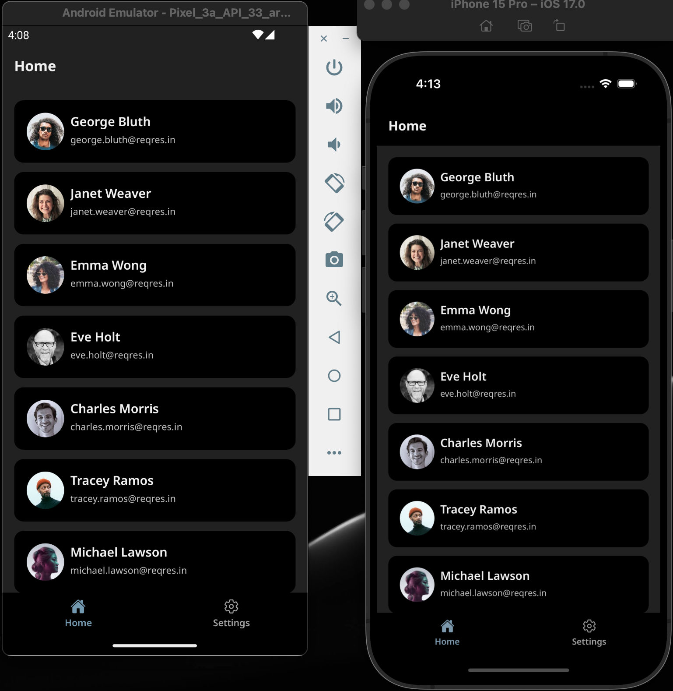
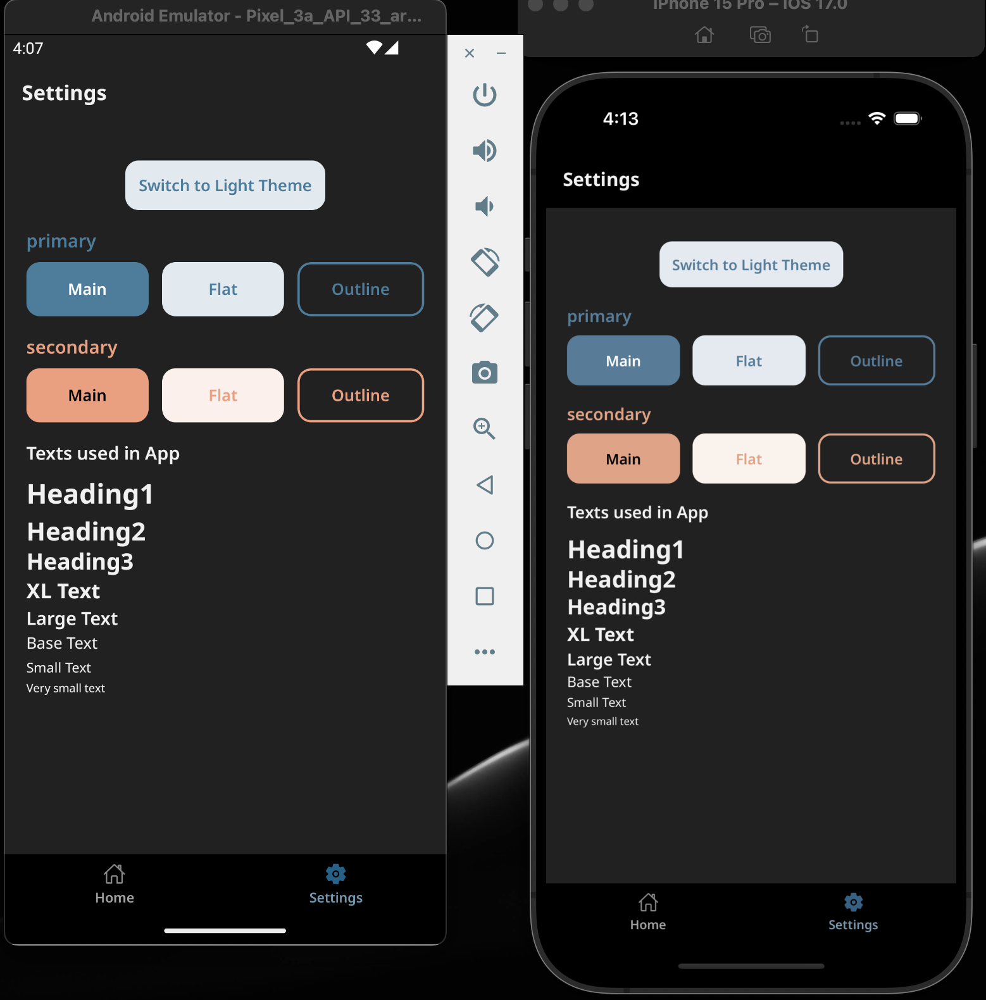
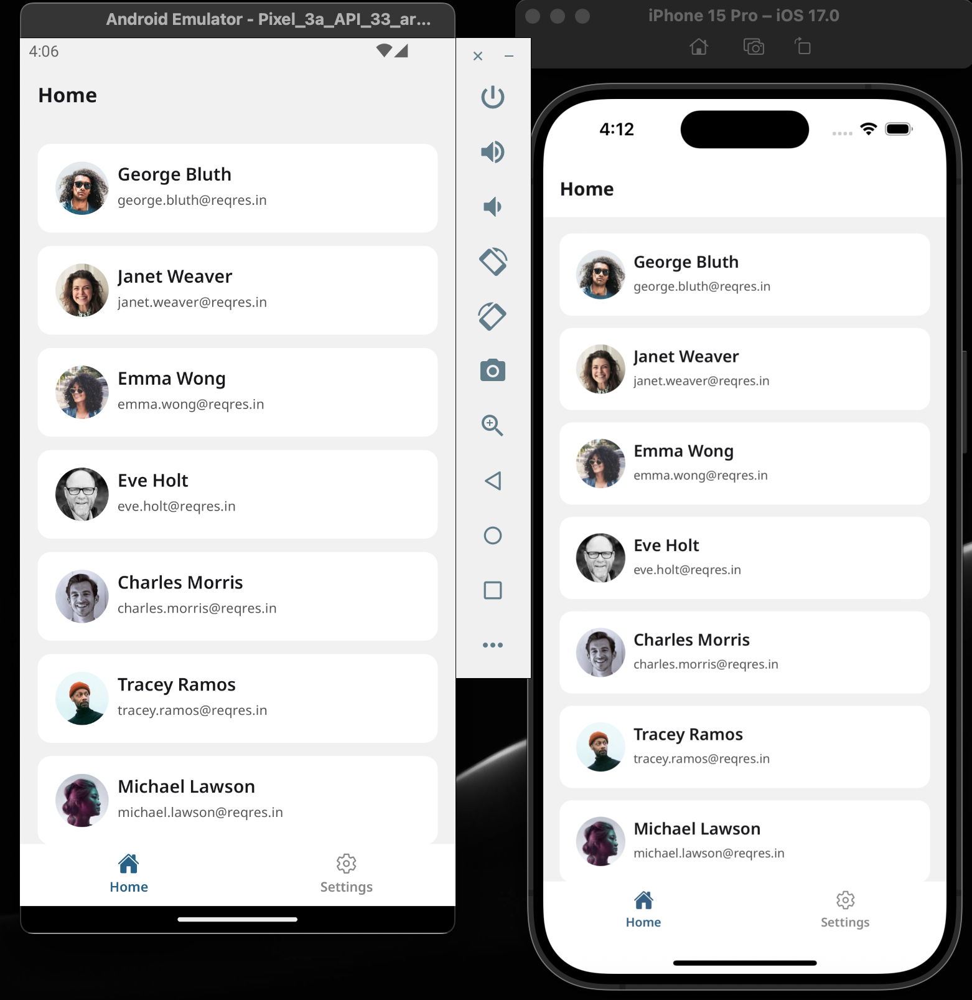
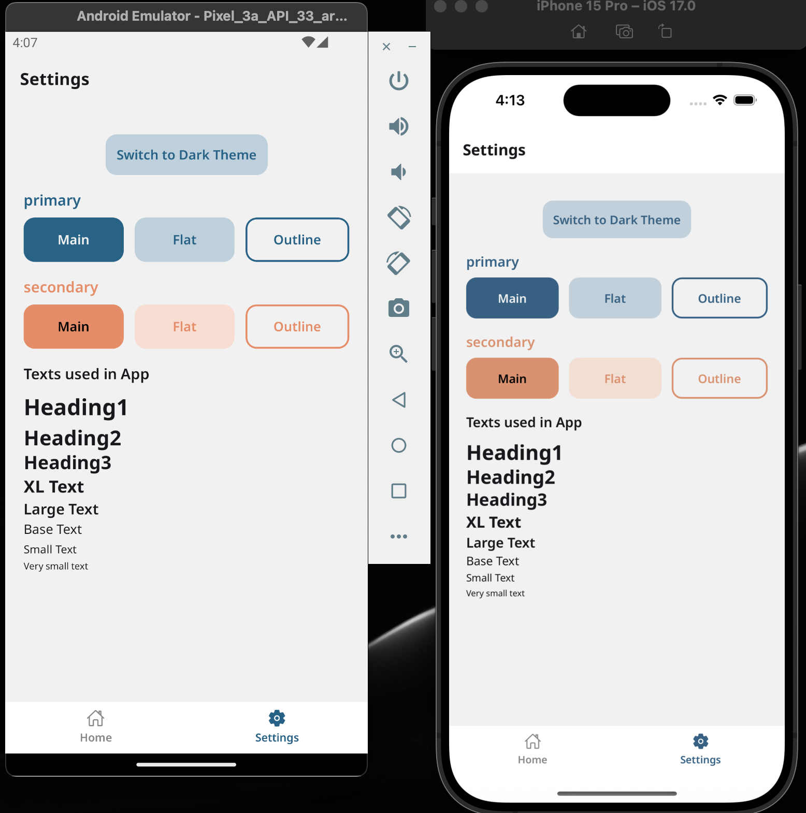

# 🚀 React Native Boilerplate App

A **minimal yet powerful React Native boilerplate** to kickstart your projects.  
It comes pre-configured with theming, navigation, environment setups, API handling, and testing utilities — designed to save time and enforce best practices from the start.

[](https://github.com/SachinRupani/RN_BoilerplateApp/actions/workflows/android-build.yml)

---

## ✨ Features

- **🎨 Theming**

  - Light and Dark themes
  - Context API-based theme switching
  - Structure ready for persistent storage

- **🧭 Custom Bottom Tabs**

  - Built-in Bottom Tab navigation (no external dependency)
  - Configurable tab title, icon, and active state
  - Icons via [`react-native-vector-icons/Ionicons`](https://github.com/oblador/react-native-vector-icons)

- **🌐 Environment Management**

  - Separate configs for **Development**, **Staging**, and **Production**
  - Extendable structure for API endpoints & env-specific variables

- **✍ Custom Fonts**

  - NotoSans

- **⚙ Platform-Specific Configs**

  - **Android**: Product flavors for different environments with unique app IDs & icons
  - **iOS**: Planned support for config-based variants

- **📱 Prebuilt Screens**

  - **Home**: Dashboard with user list (FlatList + RTK Query for API calls with caching)
  - **Settings**: Theme switcher (Light/Dark toggle)
  - **Login**: Basic login screen for validation + navigation flow

- **📦 Data Layer Setup**

  - Clean structure with **Data**, **Domain**, and **Presentation** layers
  - RTK Query for API handling (with caching by default)
  - Upcoming: Error handling support

- **🖼 Centralized Image Handling**

  - Uses `react-native-fast-image` for caching & performance
  - Wrapped in a central component → easy to swap/upgrade later

- **✅ Testing Ready**
  - **Detox** configured for end-to-end UI testing

---

## ⚡ Alternative API Layer

Looking for Redux Saga instead of RTK Query?  
Check out the branch [`task/api-redux-saga-axios`](https://github.com/SachinRupani/RN_BoilerplateApp/tree/task/api-redux-saga-axios) where API calls are managed with **Redux Saga + Axios**.

---

## 📦 Installation & Setup

1. Clone the repo
   ```sh
   git clone https://github.com/SachinRupani/RN_BoilerplateApp.git
   cd RN_BoilerplateApp
   ```
2. Install dependencies
   ```sh
   yarn
   npx pod-install ios
   ```
3. Run with the provided scripts (important — ensures env configs are applied):
   | Script | Platform | Environment | Description |
   | ---------------------------- | -------- | --------------------- | -------------------------------------- |
   | `yarn androidDev` | Android | Development | Runs dev debug flavour build |
   | `yarn androidDevRelease` | Android | Development | Runs dev release flavour build |
   | `yarn androidStaging` | Android | Staging | Runs staging debug flavour build |
   | `yarn androidStagingRelease` | Android | Staging | Runs staging release flavour build |
   | `yarn androidProdRelease` | Android | Production | Runs production release flavour build |
   | `yarn ios` | iOS | Development (default) | Runs app on iOS |
   | `yarn detox-build-ios` | iOS | Testing | Builds iOS app for Detox E2E tests |
   | `yarn detox-test-ios` | iOS | Testing | Runs Detox E2E tests on iOS |
   | `yarn detox-build-android` | Android | Testing | Builds Android app for Detox E2E tests |
   | `yarn detox-test-android` | Android | Testing | Runs Detox E2E tests on Android |

## 📸 Screenshots

#### 🌑 Dark Theme

<p>   </p>

#### ☀ Light Theme

<p>   </p>

<p>
  
  
</p>

## ❤ Show your support

Give a ⭐️ if this project helped you!

<a href="https://buymeacoffee.com/sachinrupani" target="_blank">
    
</a>
