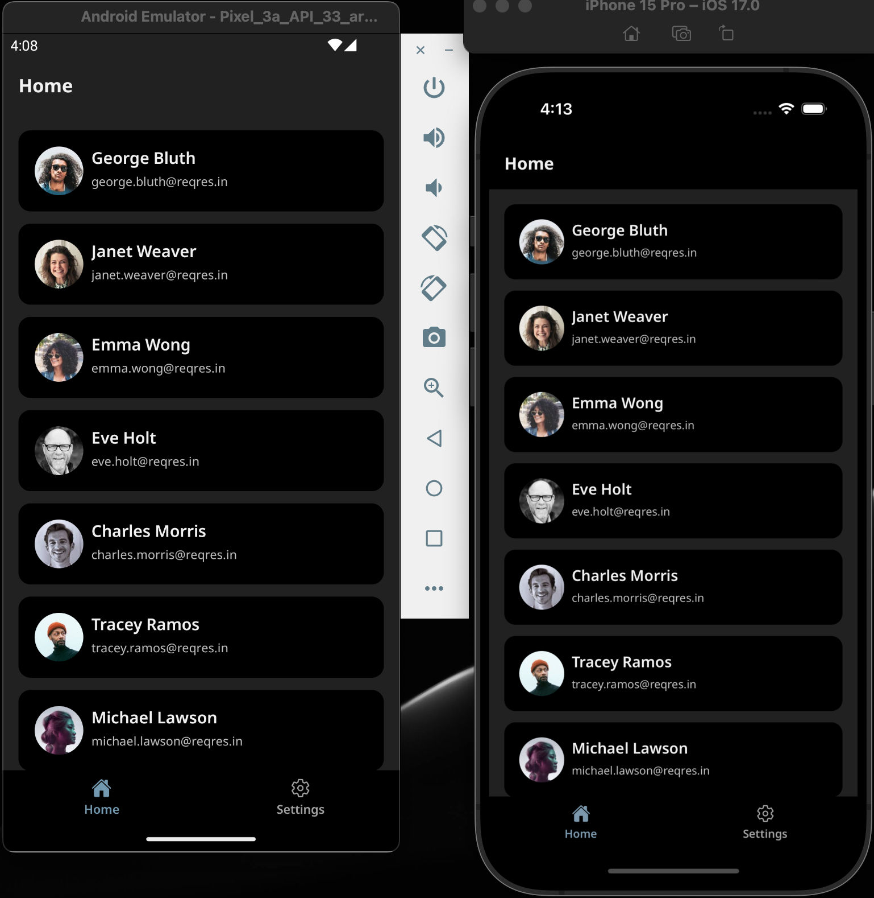
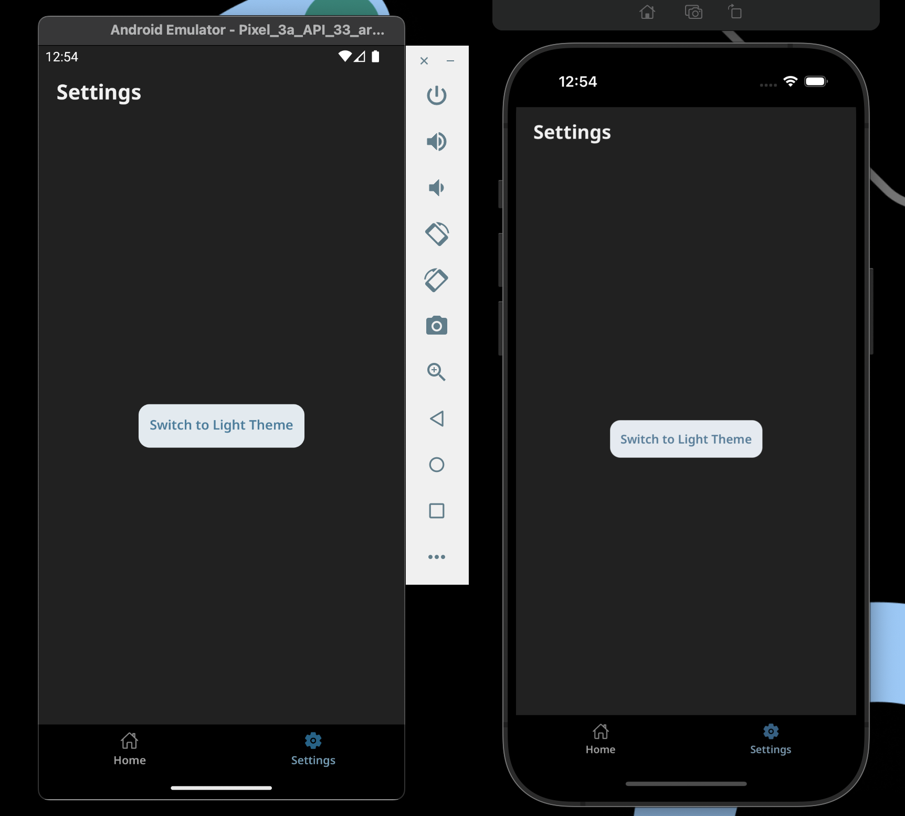
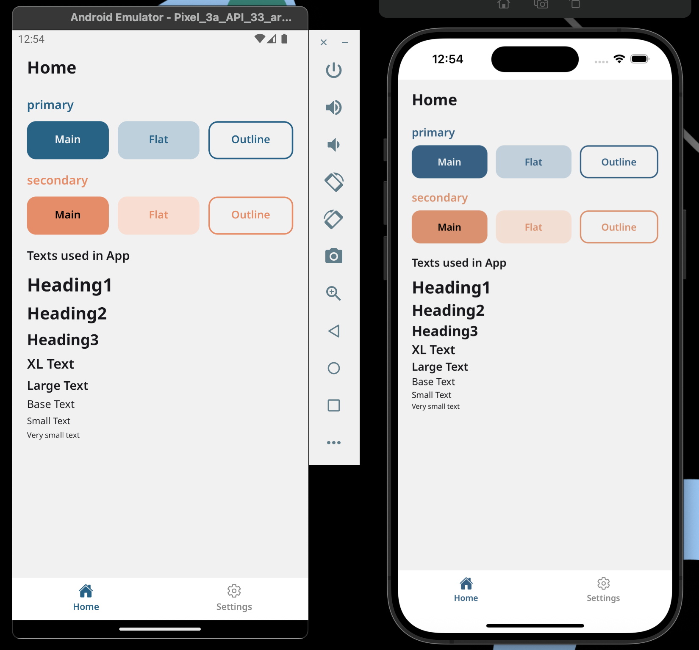
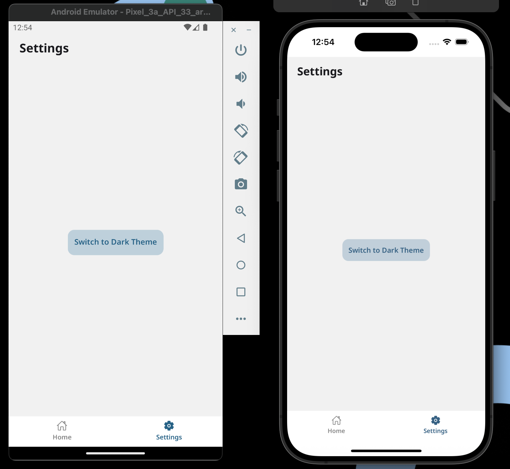

# React Native Boilerplate App

A minimal React Native boilerplate app with basic theming, navigation, and environment setup — perfect as a starting point for new projects.

## ✨ Features

- ✅ **Theme Support**

  - 🎨 Light and Dark theme color sets
  - 🔄 Theme switching using Context API
  - 💾 Persistent state-ready structure

- ✅ **Custom Bottom Tabs**

  - 🛠 Own implementation of Bottom Tab navigation
  - 📌 Flexible props for tab title, icon, and active state
  - 🖼 **Icons** powered by [`react-native-vector-icons/Ionicons`](https://github.com/oblador/react-native-vector-icons)

- ✅ **Environment Interface**

  - 🌐 Separate environment configurations (development, staging, production)
  - 📦 Easy to extend for API endpoints and environment-specific variables

- ✅ **Custom Fonts**

  - ✍ NotoSans-Regular
  - ✍ NotoSans-Medium
  - ✍ NotoSans-Semibold
  - ✍ **NotoSans-Bold**

- ✅ **Platform-Specific Configurations**

  - 🤖 **Android:** Config-based product flavours for environment-specific builds and different app icons and app id suffix too for different flavours (dev, staging and production)
  - 🍏 **iOS:** Upcoming feature — config-based app variants planned

- ✅ **Basic Screens (Dashboard)**
  - 🏠 **Home Screen** → Home Tab
  - ⚙ **Settings Screen** → Theme switch button (Light/Dark)

## ⚠️ IMPORTANT

- This boilerplate contains custom scripts in package.json for running the application.
  You must use these scripts to ensure that the correct environment configuration and build flavors are applied.
- To run the app, first clone the repo and install the yarn dependencies with the help of `yarn` command in the project folder inside terminal

Check `package.json` for all the important scripts

| Script                       | Platform | Environment           | Description                           |
| ---------------------------- | -------- | --------------------- | ------------------------------------- |
| `yarn androidDev`            | Android  | Development           | Runs dev debug flavour build          |
| `yarn androidDevRelease`     | Android  | Development           | Runs dev release flavour build        |
| `yarn androidStaging`        | Android  | Staging               | Runs staging debug flavour build      |
| `yarn androidStagingRelease` | Android  | Staging               | Runs staging release flavour build    |
| `yarn androidProdRelease`    | Android  | Production            | Runs production release flavour build |
| `yarn ios`                   | iOS      | Development (default) | Runs app on iOS                       |

## 📸 Screenshots

#### Dark Theme

  
  

#### Light Theme

  
  

## ❤ Show your support

Give a ⭐️ if this project helped you!

